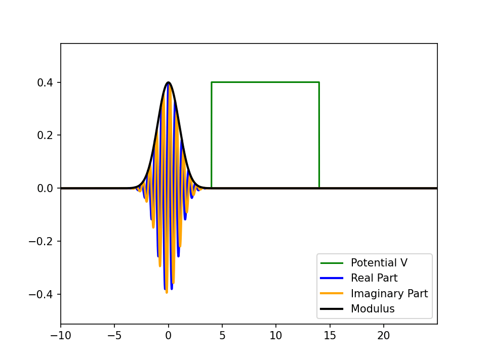

# Schrödinger Wave Function

This project simulates the Schrödinger wave function, a fundamental concept in quantum mechanics. The wave function describes the quantum state of a particle and how it evolves over time.

## Features
- Simulation of the Schrödinger wave function in one dimension.
- Visualization of the wave function's evolution over time.
- Controls to adjust parameters such as potential energy and initial conditions.

